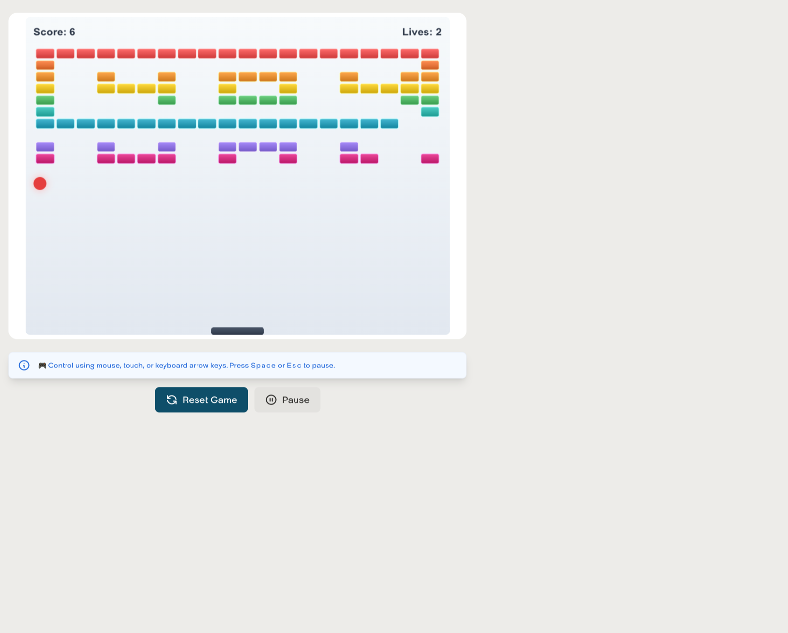

# Pages & Routing

Pages within an experience are records in **`sys_aix_page`**. The framework's router parses the URL pathname against a fixed pattern, finds the matching page in the current experience, and renders the widgets configured on it.

## The page record

`sys_aix_page` fields you'll touch most:

| Field | Meaning |
|---|---|
| title | Display name (also the document title). |
| path_pattern | The route the URL pathname is matched against. Supports parameters like `/record/:table/:sys_id`. |
| roles | Comma-separated roles required to view the page. Empty = public to authenticated users. |
| application | Scoping app. |
| page_specific_css | CSS injected on this page only. Useful for per-page layout tweaks. |
| hide_chat | Suppress the AI chat surface on this page. |

A page belongs to an experience through a relationship table (`sys_aix_experience_page_rel`). Pages can also be shared across experiences if they're scoped to the global `AI Experience Framework Components` app.

## Path patterns

Patterns use `:name` placeholders for URL segments. Each placeholder becomes a route parameter you can read in the widget's server script via `$aiux.getPathParameter(name)` (or `$aiux.getParameter(name)` for the omnibus lookup).

Examples from the OOB pages:

| Path pattern | Parameters | Use |
|---|---|---|
| /home | (none) | Landing |
| /widgets | (none) | List page |
| /edit/widget/:widgetId | widgetId | Editor |
| /edit/dashboard/:sysId | sysId | Editor |
| /knowledge/:sys_id | sys_id | Article detail |
| /catalog/:sys_id | sys_id | Catalog item detail |
| /order_guide/:sys_id | sys_id | Order guide detail |
| /chat/:chat_id | chat_id | Chat history |
| /record/:table/:sys_id | table, sys_id | Generic record viewer |
| /not-found | (none) | 404 fallback |

Wildcard catch-all support is provided through `:page*` in the framework's `DEFAULT_PATTERN`, but in practice pages use explicit named segments. If no page matches, the router falls through to `/not-found`.

## How the SPA resolves a URL

When a user hits `/aiux/builder/widgets`:

1. The runtime matches the URL against `DEFAULT_PATTERN = /<vhost>/:experience/:page*`.
2. `experience = "builder"`, `page = "widgets"`.
3. The SPA fetches `/api/now/aix/config/builder` to load the experience config (if not already cached).
4. It looks up a `sys_aix_page` with `path_pattern = "/widgets"` in the Builder experience.
5. The page record's widget instances are loaded and rendered.
6. The right-hand "on this page" navigation, the page title, and the document `<title>` are set.

If step 4 finds no match, the SPA navigates to `/not-found`.

## The 404 page (and the Breakout game)

The OOB `/not-found` page embeds a `breakout-game` widget — a fully implemented, playable clone of Atari Breakout with scoreboard, lives counter, and paddle.



This is intentional and is a callback to Service Portal's `/sp` 404, which also rendered a Breakout game. The `breakout-game` widget is real (its `sys_aix_widget` record describes it as *"Demonstrating client tools functionality and interactive widget capabilities"*) and exposes four `client_tools` — `reset-game`, `pause-game`, `get-game-state`, `set-difficulty` — making the 404 page double as the framework's onboarding demo for the agent-widget interaction model.

A consequence worth knowing: the Builder experience's config returns `landingPath: "/home"`, but no page in `sys_aix_page` has `path_pattern: "/home"` for the Builder. Navigate to `/aiux/builder` and the router falls through to `/not-found` — Breakout, every time. You can fix this by either creating a `/home` page or pointing `landingPath` at an existing path like `/widgets`.

## Route parameters in widget code

Inside a widget's `component` field, read route parameters via the `locationService`:

```js
import { locationService } from '@servicenow/aiux-services';

class FormWidget extends AIUXWidgetElement {
  constructor() {
    super();
    const params = locationService.params();
    this.options = { table: params.table, sys_id: params.sys_id };
  }
}
```

Inside a widget's server script, use `$aiux`:

```js
data.sys_id = $aiux.getParameter('sys_id');   // walks precedence
// or, if you want to be specific about which surface:
data.path_id = $aiux.getPathParameter('sys_id');
data.query_id = $aiux.getSearchParameter('sys_id');
```

For the full `$aiux` reference see [Widgets → Server Script](../widgets/server-script.md).

## Programmatic navigation

From a widget's Lit component:

```js
import { locationService } from '@servicenow/aiux-services';

handleClick() {
  locationService.navigate('/knowledge/KB0000030');
  // or:
  locationService.navigate('/knowledge/' + sysId, { replace: true });
}
```

`navigate(path)` adds a history entry; `navigate(path, { replace: true })` swaps the current entry. Both use the experience-relative path — you don't need to prefix `/aiux/<suffix>/`. The framework handles the vhost and experience segments for you.

To go back: `locationService.back()`. To watch for route changes: `locationService.subscribe(callback)`. Full API in [Widgets → Component → Services](../widgets/component.md#locationservice--routing).
