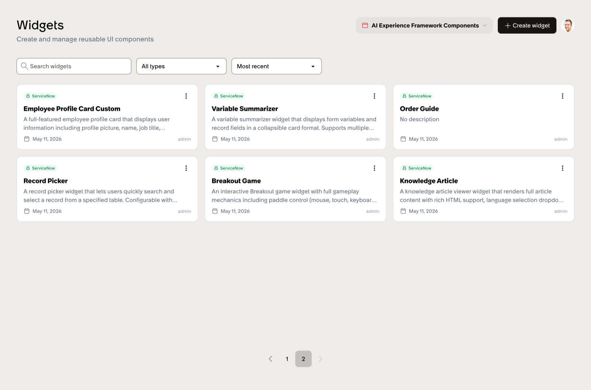

# Installing

`sn_aiux` ships on **Zurich Patch 9**. To light it up, you install three store apps from the ServiceNow Store:

- **`sn_aiux_ia_config`** — Information Architecture / experience configuration
- **`sn_aiux_builder`** — the Builder app itself, served at `/aiux/builder/...`
- **`sn_aiux_components`** — the OOB widget library (Form, Catalog Item, Order Guide, Activity Stream, Breakout, etc.)

All three must be installed and activated before any `sys_aix_*` records are addressable.

## Verifying the install

Once the apps are present, the Application Navigator gets a new module called **AI Experience Framework (AIUX)** with sub-modules for:

- Experiences
- Pages
- Containers
- Widgets
- Widget Instances
- Widget Dependencies
- Dashboards
- Menus
- Themes

Anyone who's spent time in the Service Portal application navigator will recognize the shape — it's deliberately the same. ServiceNow has clearly internalized that the path to adoption runs through familiarity, and it built the navigation accordingly.

You can also confirm the install by hitting the Builder directly: `https://<your-instance>.service-now.com/aiux/builder/widgets`. If you see the widget catalog, the framework is live.

## Permissions

The Builder UI requires the `aix_widget_admin` role to create or edit widgets, and `aix_canvas_admin` to edit dashboards. Plain `admin` is sufficient for both.

## Earlier patches

`sn_aiux` is not present before Zurich Patch 9. The bundle (`/sncapps/aix/assets/...`), the `sys_aix_*` tables, and the `/aiux/<suffix>/<page>` URL pattern all rely on platform plumbing that arrived with Zurich P9. If you're on an earlier patch, the store apps will install but the runtime won't resolve.

## What to do next

Try [Your first widget](your-first-widget.md) — a walkthrough that takes a real out-of-the-box Service Portal widget and surfaces it inside an `sn_aiux` experience in roughly twenty lines of Lit.
