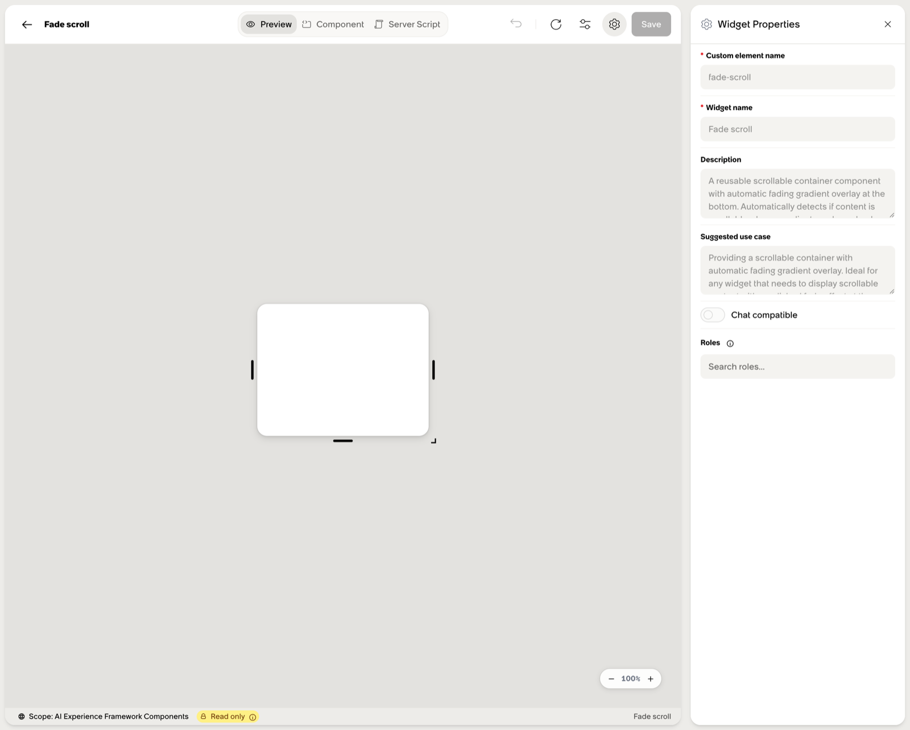

# Your first widget

The fastest way to understand `sn_aiux` is to bring something familiar over from Service Portal and watch it run inside the new framework. This walkthrough takes **Cool Clock** — an analog-clock widget that ships out of the box on every ServiceNow instance — and surfaces it inside an `sn_aiux` experience with no modifications to the original widget.

For a from-scratch native widget, see [Going native](#going-native) at the end.

## The Cool Clock — what we're working with

The OOB Service Portal widget has an `id` of `widget-cool-clock` and exactly two configurable options:

```json
[
  { "name": "zone",    "default_value": "America/Los_Angeles",
    "section": "Data",         "label": "TimeZone",          "type": "string" },
  { "name": "c_color", "default_value": "red",
    "section": "Presentation", "label": "Second hand color", "type": "string" }
]
```

We are not going to rewrite Cool Clock. The whole point of this exercise is that we *don't have to*. The widget already exists, it already works in Service Portal, and the Service Portal Bridge will run it inside `sn_aiux` unchanged. All we're building is the `sn_aiux` adapter.

## Step 1 — create the adapter

Navigate to **`/aiux/builder/widgets`** and click **Create new widget**.



- **Custom element name (id):** `cool-clock-aix`
- **Widget name:** Cool Clock
- **Description:** Bridges the OOB `widget-cool-clock` Service Portal widget into an `sn_aiux` experience.
- **Category:** custom

Set the **Component** field to:

```js
import { html } from 'lit';
import { AIUXWidgetElement } from '@servicenow/aiux-components-core';

class CoolClockAix extends AIUXWidgetElement {
  static properties = {
    zone:    { type: String },
    c_color: { type: String },
  };

  createRenderRoot() { return this; }

  constructor() {
    super();
    this.zone = 'America/Los_Angeles';
    this.c_color = 'red';
  }

  render() {
    const options = {
      zone:    this.zone,
      c_color: this.c_color,
    };
    return html`
      <aiux-angular-element
        .widgetId=${'widget-cool-clock'}
        .options=${options}>
      </aiux-angular-element>`;
  }
}
```

Set the **Input schema** field to mirror the SP widget's options so the Builder UI surfaces them:

```json
{
  "zone":    { "type": "String", "description": "TimeZone (e.g. America/Los_Angeles)" },
  "c_color": { "type": "String", "description": "Second hand color" }
}
```

Leave the **Server script** field as the empty IIFE. The original `widget-cool-clock` already has its own server script and the bridge will run it.

## Step 2 — drop it on a page

Open a `sys_aix_page` in your experience and add a `cool-clock-aix` widget instance. Configure `zone` and `c_color` from the inline form.

## Step 3 — see it run

The Lit wrapper mounts. The framework spins up `<aiux-angular-element>`, which boots the embedded AngularJS Service Portal runtime inside the Lit DOM, looks up `widget-cool-clock` by its `sp_widget.id`, runs that widget's server script with the supplied `options`, and renders the existing template inside your `sn_aiux` page. The clock ticks. The second hand is the color you asked for. The timezone is the one you asked for. Nothing about the widget itself changed.

That's the whole pattern. **One server script, written once. Twenty lines of Lit adapter. Zero rewrites for the actual widget logic.** Multiply that by every widget in your existing portal and you can see why the bridge is a bigger deal than the rest of the framework combined.

For the mechanism in detail and the three OOB widgets that ship using this pattern, see [Widgets → Service Portal Bridge](../widgets/service-portal-bridge.md).

---

## Going native

The Cool Clock is the safe story — bring what you have, get it on the screen, ship. The other half of the pitch is what happens when you write a widget *natively* against `sn_aiux`. For that, build the `$aiux` showcase: a small Lit widget whose server script exercises each of the four documented methods on `$aiux` and renders the live return values with DaisyUI.

It exercises every layer in one component:

- **Server script** — calls `$aiux.getParameter`, `$aiux.getPathParameter`, `$aiux.getSearchParameter`, and `$aiux.getWidget` and packages the live results.
- **Option schema** — a couple of configurable inputs (the parameter name to probe, the widget id to compose).
- **Lit + DaisyUI** — composes `<aiux-alert-message>`, `aiux-table`, `aiux-badge` to render the results.
- **client_tools** — declares `setProbeKey({ key })` so an AI agent can rerun the probes against a different parameter name.

The full source is in [Widgets → AI Integration](../widgets/ai-integration.md).
