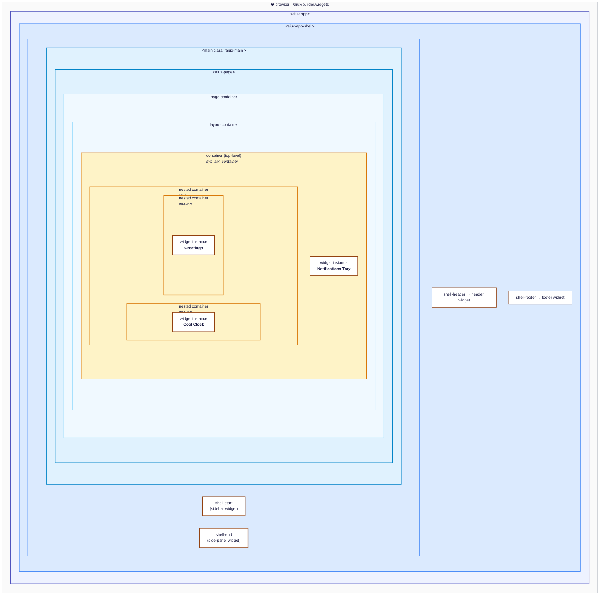
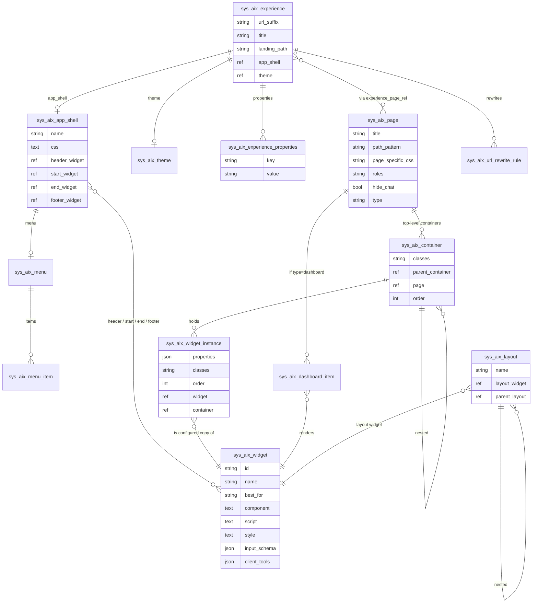
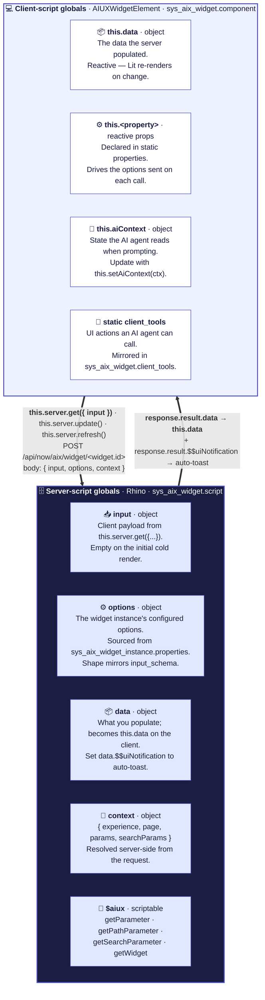

# Architecture diagrams

Four diagrams, each covering one part of the `sn_aiux` architecture: what mounts inside what, which tables back it, what happens on a page load, and how a widget's server and client halves talk to each other. They render natively on GitHub as Mermaid.

---

## 1. The mounting hierarchy (nested boxes)

**What it shows:** the literal containment — what's inside what — in the spirit of the classic Service Portal CSS docs diagram. Outer to inner: browser → `aiux-app` → `aiux-app-shell` (with its four region slots + the main content area) → `aiux-page` → `page-container` → `layout-container` → containers → widget instances. Every level here is light-DOM rendered into the previous.



> **What to take away:** the framework wraps your widget in five concentric layers — *experience shell* (chrome around every page), *page* (swapped per route), *page-container + layout-container* (style hooks), then your *containers* (which can nest arbitrarily, like rows containing columns) — before you ever get to a widget instance. Each container is a `<div>` with utility classes and a `data-container-id`; nesting is configured by setting `parent_container` on `sys_aix_container` rows. Widget instances are the leaves.

> **How this maps to the SP analogy:** `aiux-app-shell` ≈ the SP portal's outer chrome. `aiux-page` ≈ an `sp_page`. The container/widget nesting is exactly the SP container/row/column pattern, just stored in `sys_aix_container` records and rendered to plain divs with Tailwind/DaisyUI utility classes instead of SP's hard-coded `.container > .row > .col-md-*` Bootstrap grid.

---

## 2. The data model

**What it shows:** which tables back what's on the screen, and how the records reference each other.



> **What to take away:** an *experience* owns an *app shell* (chrome), a *theme* (color tokens), and a bag of *properties* (config). It points to *pages* through a m2m rel. A page owns a tree of *containers*; containers hold *widget instances*; widget instances are configured copies of *widget records* (the type). Dashboard pages take a different path: *dashboard items* + *layouts* (themselves driven by `sys_aix_widget` records, recursively nestable). The same widget catalog feeds both worlds.

---

## 3. The page-load sequence

**What it shows:** the request-flow timeline from URL hit to widgets rendered. Two multipart/mixed streaming endpoints do almost all the work; per-widget HTTP only happens on explicit refresh.

```mermaid
sequenceDiagram
    autonumber
    participant U as User
    participant B as Browser
    participant DO as $ai_experience.do
    participant App as aiux-app
    participant Shell as aiux-app-shell
    participant Page as aiux-page
    participant API as sn_aiux API

    U->>B: Navigate /aiux/builder/widgets
    B->>DO: GET $ai_experience.do
    DO-->>B: SPA HTML (sets window.NOW.portal_id = aiuxsp)
    B->>App: mount aiux-app (URLPattern parses experience=builder, page=widgets)
    App->>App: router.init() + initiateOAuth()
    App->>API: GET /api/now/aix/config/builder
    Note over App,API: multipart/mixed stream
    API-->>App: experienceData<br/>(theme, landingPath, properties)
    API-->>App: appShellData<br/>(header/start/end/footer widget tagNames + css)
    API-->>App: urlRewriteRules<br/>(legacy SP/.do redirects)
    App->>Shell: render aiux-app-shell
    Shell->>Shell: lazy-load header/start/end/footer widget chunks
    Shell->>Page: mount aiux-page

    Page->>API: POST /api/now/aix/page/config<br/>{pagePath: '/widgets'}
    Note over Page,API: multipart/mixed stream
    API-->>Page: pageMeta {pageSysId, pageType}
    Page->>Page: dynamic-import /aix/page_bundle/&lt;sysId&gt;.jsdbx
    API-->>Page: pageData {title, css, type, containers, pathParams}
    API-->>Page: widgetData {sysId: server-script output}
    Note over Page: server pre-runs each widget's script,<br/>ships data inline — no N+1
    Page->>Page: renderContainers(containers, widgetData)
    Page->>Page: each instance mounts as a custom element<br/>with .data already populated
    Page-->>App: AIUX_FIRST_PAGE_LOAD_COMPLETE
    App->>App: hide Lottie loader

    rect rgb(248,246,235)
    Note over U,API: After mount — widget refresh
    U->>Page: clicks "Refresh" in a widget
    Page->>API: POST /api/now/aix/widget/&lt;widget.id&gt;<br/>{input, options, context}
    API-->>Page: {data, $$uiNotification}
    Page->>Page: widget.data ← data
    Page->>Page: notifications.processServerNotifications<br/>auto-toasts
    end
```

> **What to take away:** the cold load is two streaming requests. The first carries the experience config + app shell. The second carries the page metadata *plus every widget's pre-rendered data*, inlined as separate parts of the same stream. Per-widget HTTP only kicks in when a widget calls `this.server.refresh()` after the page is mounted. The `$$uiNotification` magic key on any server response surfaces as a toast for free.

---

## 4. The widget interaction model (server ↔ client)

**What it shows:** the SP-doc-style "globals" picture for an sn_aiux widget. Server side at the top, client side at the bottom, two clean arrows showing the request cycle. Same spirit as the classic *server script globals / client script globals* infographic, with the AIUX-specific additions (`$aiux`, `context`, `this.aiContext`, `client_tools`) called out.



> **What to take away:** every server call is one POST to `/api/now/aix/widget/<widget.id>` carrying three things — `input` (what you sent), `options` (your widget's reactive properties), and `context` (the route info). The server populates `data`, optionally tucks a `$$uiNotification` payload alongside, and the client merges both into a reactive update + a free toast. The four AIUX-specific additions over SP — `$aiux`, `context`, `this.aiContext`, and `static client_tools` — are what make the same widget pattern interoperate with the AI agent.

> **What's the same as Service Portal:** the IIFE signature `(function(data, options, input) { ... })(data, options, input)`. All your `gs.*` and `GlideRecord` knowledge ports over unchanged.

> **What's different:** the **context** parameter is now a first-class server-side global (route info pre-resolved, no `gs.action.getGlideURI()` gymnastics). The **`$aiux`** scriptable is the spiritual successor to `$sp`, with `getWidget()` preserved as the composition primitive. Two brand-new concepts — **`this.aiContext`** on the client and **`static client_tools`** declarations — are how the widget participates in AI conversations. The transport endpoint is `/api/now/aix/widget/<id>` (instead of `/api/sp/widget/<id>`), and notifications use the `$$uiNotification` channel on the response payload (same shape SP uses, kept verbatim for muscle-memory).

---

## Rendering notes

- `<br/>` line breaks inside labels work in both `flowchart` and `sequenceDiagram` blocks.
- `&lt;` / `&gt;` are needed to display literal angle brackets in labels (e.g. `<aiux-widget>` → `&lt;aiux-widget&gt;`).
- The `rect rgb(...)` block in diagram 3 highlights the post-mount interaction phase.
- To render on a dark background, add `%%{init: {'theme':'dark'}}%%` as the first line of a diagram.

## Contributing a diagram

A fifth diagram that would earn its place: the Service Portal bridge — `<aiux-widget>` → `<aiux-angular-element>` → embedded Angular runtime → `sp_widget`. See [CONTRIBUTING](../../CONTRIBUTING.md).
