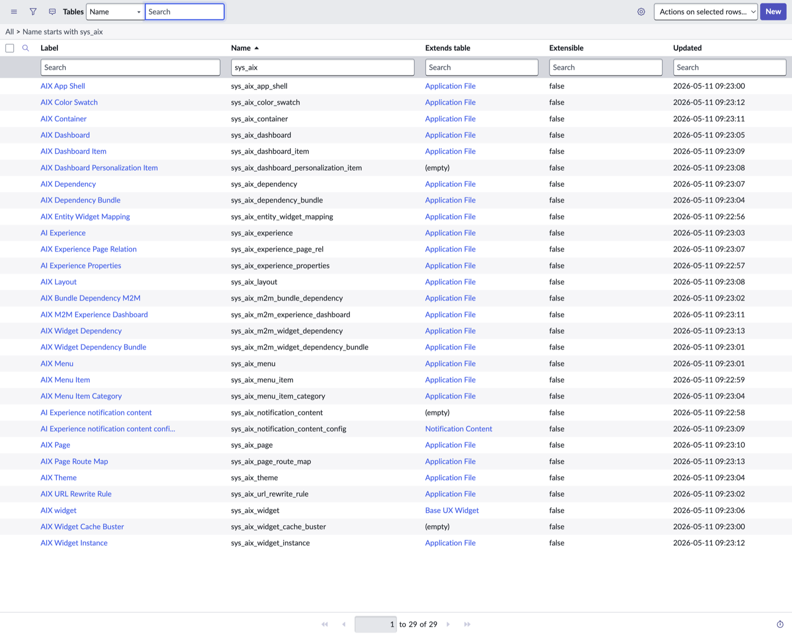

# `sys_aix_*` Tables (29)

All in the `global` application scope.

## Grouped by purpose

### Experience definition (the "portal" itself)
| Table | Label | Extends |
|---|---|---|
| `sys_aix_experience` | AI Experience | sys_metadata |
| `sys_aix_experience_properties` | AI Experience Properties | sys_metadata |
| `sys_aix_experience_page_rel` | AIX Experience Page Relation | sys_metadata |
| `sys_aix_app_shell` | AIX App Shell | sys_metadata |
| `sys_aix_theme` | AIX Theme | sys_metadata |
| `sys_aix_color_swatch` | AIX Color Swatch | sys_metadata |

### Pages & routing
| Table | Label | Extends |
|---|---|---|
| `sys_aix_page` | AIX Page | sys_metadata |
| `sys_aix_page_route_map` | AIX Page Route Map | sys_metadata |
| `sys_aix_url_rewrite_rule` | AIX URL Rewrite Rule | sys_metadata |
| `sys_aix_layout` | AIX Layout | sys_metadata |
| `sys_aix_container` | AIX Container | sys_metadata |

### Widgets
| Table | Label | Extends |
|---|---|---|
| `sys_aix_widget` | AIX widget | **sys_ux_widget** ← key inheritance |
| `sys_aix_widget_instance` | AIX Widget Instance | sys_metadata |
| `sys_aix_widget_cache_buster` | AIX Widget Cache Buster | — |
| `sys_aix_entity_widget_mapping` | AIX Entity Widget Mapping | sys_metadata |
| `sys_aix_dependency` | AIX Dependency | sys_metadata |
| `sys_aix_dependency_bundle` | AIX Dependency Bundle | sys_metadata |
| `sys_aix_m2m_widget_dependency` | AIX Widget Dependency | sys_metadata |
| `sys_aix_m2m_widget_dependency_bundle` | AIX Widget Dependency Bundle | sys_metadata |
| `sys_aix_m2m_bundle_dependency` | AIX Bundle Dependency M2M | sys_metadata |

### Menus / navigation
| Table | Label | Extends |
|---|---|---|
| `sys_aix_menu` | AIX Menu | sys_metadata |
| `sys_aix_menu_item` | AIX Menu Item | sys_metadata |
| `sys_aix_menu_item_category` | AIX Menu Item Category | sys_metadata |

### Dashboards
| Table | Label | Extends |
|---|---|---|
| `sys_aix_dashboard` | AIX Dashboard | sys_metadata |
| `sys_aix_dashboard_item` | AIX Dashboard Item | sys_metadata |
| `sys_aix_dashboard_personalization_item` | AIX Dashboard Personalization Item | — |
| `sys_aix_m2m_experience_dashboard` | AIX M2M Experience Dashboard | sys_metadata |

### Notifications
| Table | Label | Extends |
|---|---|---|
| `sys_aix_notification_content` | AI Experience notification content | — |
| `sys_aix_notification_content_config` | AI Experience notification content configuration | **sys_notification_content** |

## Key inheritance signals

- `sys_aix_widget` extends **`sys_ux_widget`** — the same parent as Next Experience UI Builder widgets. AIUX widgets sit in the same family tree as the rest of ServiceNow's modern web-component framework, not Service Portal (`sp_widget`).
- `sys_aix_notification_content_config` extends **`sys_notification_content`** — AIUX in-experience notifications plug into the platform notification stack.
- Most other AIUX tables extend `sys_metadata`, so records are update-set-aware (capture-able for promotion).
- The Service Portal connection we observed in `window.NOW.portal_url_suffix = "aiuxsp"` is **not** modeled as an `sys_aix_*` table — it lives in `sp_portal`, and the AIUX runtime references it indirectly (e.g., `new GlideSPScriptable(AIUX_PORTAL_ID)` inside an AIUX widget server script).
