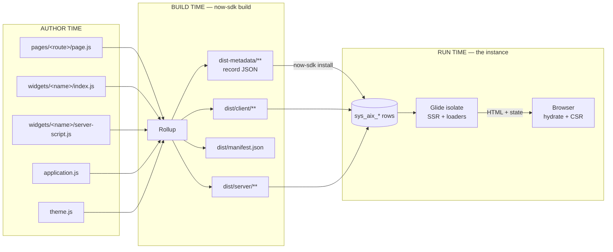

# Building with the SDK

Everything under **Widgets** and **Experiences** describes the *Builder* path: you open `/aiux/builder/widgets`, create a `sys_aix_widget` record, and type Lit into its `component` field. There is a second path, and it is the one a delivery team will actually use: a local repository, built with the ServiceNow SDK, that **compiles into `sys_aix_*` records**.

> **Version note.** This section was written against `@servicenow/aiux` 22.42.3 and `@servicenow/sdk` 4.11.0 (August 2026), with `lit` ^3.2. That is later than the Zurich P9 bundle analysis the rest of these docs are based on. Where the two disagree, assume the SDK path is newer and verify on your instance.

## The one idea to hold onto

AIUX, on the SDK path, is a **file-routed, server-rendered Lit application that compiles into ServiceNow records.**

- *File-routed*: the folder layout under `pages/` is the route table. `pages/incidents/page.js` is `/incidents`.
- *Server-rendered*: your components render to HTML in a Glide isolate on the instance, then hydrate in the browser. Your class runs in two environments. See [Pages, loaders & SSR](pages-loaders-and-ssr.md).
- *Compiles into records*: `now-sdk build` bundles your JavaScript **and** emits a folder of `sys_aix_*` record JSON. `now-sdk install` pushes those records to the instance. Nothing is served from a CDN or a Node host. Your app becomes rows in tables.

The consequence worth memorising: **the metadata you write as decorators is not documentation. It is data.** `@bestFor('...')` becomes the `best_for` column that an AI agent reads when deciding whether to place your widget. See [Widgets & decorators](widgets-and-decorators.md).

## Three moments, three different worlds

Most confusion on this path is a category error: applying a rule from one column in another.

| | Author time | Build time | Run time |
|---|---|---|---|
| **Where** | Your editor | Rollup, via `now-sdk build` | The instance |
| **What's real** | ES modules, Lit templates, decorators, Tailwind classes | Two artifacts: browser bundles in `dist/`, record JSON in `dist-metadata/` | `sys_aix_*` rows; SSR in a Glide isolate; hydration and client rendering in the browser |
| **Server script** | An ES module with a default export | Wrapped into the IIFE Glide expects | Runs on the instance with the full Glide API |



## Your files, as records

Read off `dist-metadata/aiux-json/` after a build. This is the mapping to memorise.

| Source | Becomes | Why you care |
|---|---|---|
| `aiux.json` | `sys_aix_experience` | The app itself. `basename` is the URL segment after `/aiux/`. `landing` is the default path. |
| `pages/<route>/page.js` | `sys_aix_page` | Carries `path_pattern`, `roles`, `order`, `hide_chat`. **Access control lives here, not in your JS.** |
| — the same file — | `sys_aix_widget` (page-widget) | **Every page is also a widget.** The page record points at it via `page_widget`. |
| `widgets/<name>/index.js` | `sys_aix_widget` | Your decorators become its columns. |
| `application.js` | `sys_aix_widget` (layout-widget) | The app shell ships as a widget too. |
| page ↔ experience | `sys_aix_experience_page_rel` | Join rows. Why a page can exist in the table and still not appear in the experience. |
| `theme.js` | `sys_aix_theme` + `sys_aix_color_swatch` | Object notation for `neutral_colors` mints a *new* swatch; a string reuses a shipped one. |
| `tailwind.app.css`, `head.app.css` | `sys_aix_experience_properties` | Stylesheets travel as experience properties, not static files. |

"Every page is also a widget" is the sentence that makes the schema in [Reference → Tables](../reference/tables.md) stop looking arbitrary. It is why routes carry `roles` and `order`, why decorators are mandatory, why deploying is `install` rather than a file copy, and why the platform's AI can find your widget at all.

## Project layout

```
my-experience/
├── aiux.json                   # experience: basename, landing path
├── application.js              # app shell + nav (a plain object, not a component)
├── theme.js                    # AppTheme tokens → sys_aix_theme
├── tailwind.app.css            # adopted into every shadow root
├── head.app.css                # linked once, document-wide (the only place for @font-face)
├── pages/
│   ├── home/page.js            # route: /  and /home
│   ├── incidents/page.js       # route: /incidents
│   └── home/components/        # page-scoped components
├── widgets/
│   └── hello-world/
│       ├── index.js            # AIUXWidgetElement + decorators
│       └── server-script.js    # runs on the instance
├── components/                 # shared by 2+ pages (create when needed)
├── loaders/  contexts/  constants/  utils/   # conventions, create when needed
├── eslint.config.mjs           # five AIUX eslint plugins: style, app, a11y, i18n, ssr
└── package.json
```

Two shell patterns exist. The **production** pattern has `application.js` own the shell and no app-level `pages/layout.js`. The alternative uses nested `pages/<route>/layout.js` files. Pick one; the template you start from will already have.

## Import paths: the one that will bite Builder users first

The Builder editor, the OOB widgets, and the [Component](../widgets/component.md) reference all import from the bare package names the runtime exposes in the browser:

```js
import { AIUXWidgetElement } from '@servicenow/aiux-components-core';
```

In an SDK project **that package does not exist in `node_modules`**. There is one package, `@servicenow/aiux`, with subpath exports for each module:

```js
import { AIUXWidgetElement, decorators } from '@servicenow/aiux/aiux-components-core';
import { customElement } from 'lit/decorators.js';
```

Same symbols, same behaviour. If you paste a Builder snippet into an SDK project and get a missing-module error, this is why.

## What to read next

- [Widgets & decorators](widgets-and-decorators.md): what makes a file a widget, and how decorators become columns.
- [Pages, loaders & SSR](pages-loaders-and-ssr.md): the request lifecycle and the rules it imposes.
- [Dev loop](dev-loop.md): running, building, linting, deploying.
