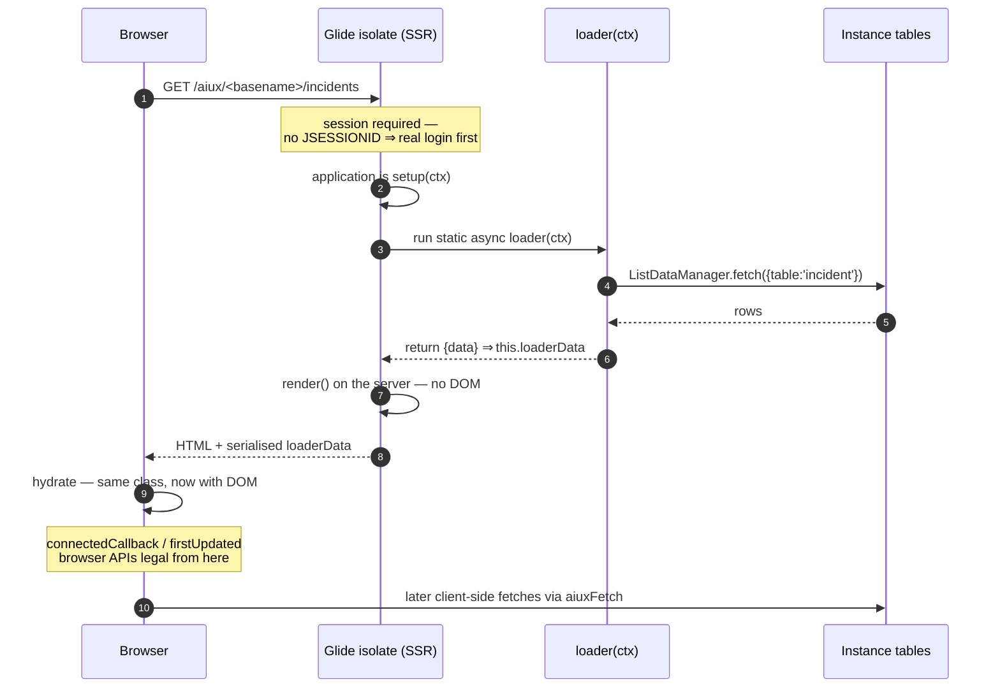
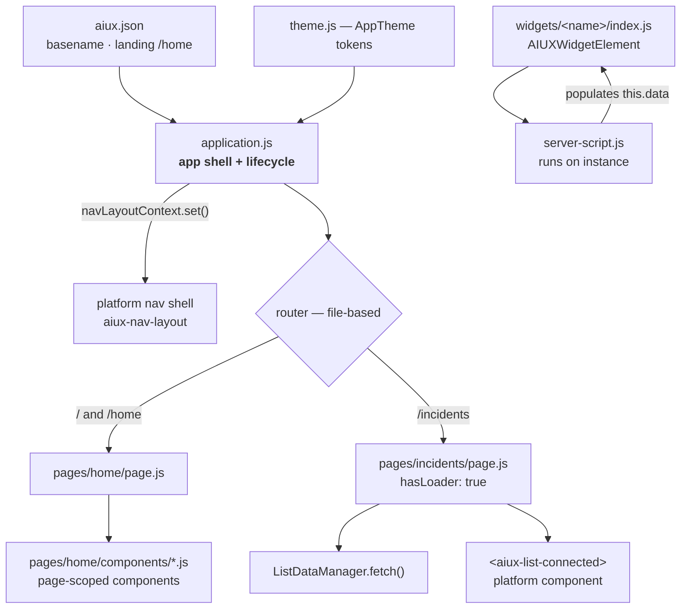

# Pages, loaders & SSR

On the SDK path, pages are Lit components too, and they render **on the server first**. This page covers what a page file looks like, how data gets into it before render, what happens when a user opens a URL, and the rules that follow from rendering in an environment with no DOM.

> Version note: `@servicenow/aiux` 22.42.3, `@servicenow/sdk` 4.11.0. See [Overview](overview.md).

## A page

```js
// pages/incidents/page.js
import { html, css } from 'lit';
import { customElement } from 'lit/decorators.js';
import { AIUXElement, ListDataManager } from '@servicenow/aiux/aiux-components-core';

@customElement('x-acme-myapp-incidents-page')      // scope-prefixed tag name
export default class IncidentsPage extends AIUXElement {
  static styles = css`:host { display: contents; }`;

  static async loader(ctx) {
    const data = await ListDataManager.fetch({
      table: 'incident',
      query: ctx.query?.sysparm_query || 'active=true',
    }).catch(() => null);                          // never throw from a loader
    return { data };                               // ⇒ this.loaderData
  }

  render() {
    const { data } = this.loaderData || {};        // always guard: may be undefined
    return html`
      <aiux-list-connected
        table="incident"
        .data=${data}
        .pageSize=${10}
        .listOptions=${{ heading: 'Open incidents', showCount: true }}
      ></aiux-list-connected>`;
  }
}
```

Three things to notice:

- **The route comes from the folder name, not the tag.** `pages/incidents/page.js` is `/incidents`. `pages/home/page.js` serves `/` and `/home`.
- **Default export plus `@customElement`, both required.** Same rule as widgets.
- **`display: contents`** makes the page's host box vanish from layout, so its children participate in the parent's grid directly. Custom elements default to `display: inline`, which breaks layout in surprising ways, so every component sets a `:host` display. By convention `static styles` is reserved for `:host` alone and everything else is Tailwind classes in the template.

The page becomes a `sys_aix_page` row plus a page-widget `sys_aix_widget` row. Defaults written by the build: `title` = the tag name, `path_pattern` = the route, `hide_chat: false`, `order: 100`, `roles` empty. Access control is a column on the page record, not something you do in JavaScript, and you set it with decorators:

```js
@customElement('x-acme-myapp-admin-page')
@roles(['admin', 'x_acme_myapp.editor'])   // → sys_aix_page.roles
@protectionPolicy('read')                  // → sys_policy on page and page-widget
@title('Administration')
export default class AdminPage extends AIUXElement { … }
```

`@global(false)` couples a page to the experience instead of leaving it global, and requires a `basename` in `aiux.json`. Full decorator table in [Widgets & decorators](widgets-and-decorators.md#the-full-set).

A page can also read `this.isEmbedded` to tell whether it is rendered inside a `<route-view>` (a side panel, for instance) and simplify itself accordingly. It is always `false` during SSR.

## Loaders: the hook AIUX adds to Lit

Plain Lit has no data-fetching story. You would fetch in `connectedCallback`, which only works in a browser and only *after* first paint. Useless for server rendering; the server would ship an empty shell.

So AIUX adds one hook. A **loader** is a `static async` method that runs *before* the component renders, and whose return value is handed to the instance as `this.loaderData`:

```js
static async loader(ctx) { return { rows: await fetchRows() }; }

render() {
  const { rows } = this.loaderData || {};
}
```

It is `static` because it runs before any instance exists. `ctx` has the same shape on the server and the client:

| `ctx.` | Contents |
|---|---|
| `params` | Route params from the matched URL, e.g. `{ table: 'incident' }` |
| `query` | Query-string params, with the framework's internal params filtered out |
| `pagePath` | The route pattern, e.g. `/list/:table` |
| `basePath` | The app's URL prefix, e.g. `/aiux/<basename>` |
| `protocol`, `hostname` | From the request (server) or `window.location` (client) |
| `headers.cookie` | The user's session cookie on the server; empty on the client, where the browser sends it |
| `csrfToken` | The `g_ck` token for authenticated calls |
| `embedded` | `true` when the page is rendered inside a `<route-view>`, such as a side panel |

Two habits that follow:

- **Never throw.** `.catch(() => null)` and `Promise.allSettled` over `Promise.all`, so one failed fetch can't blank the page.
- **The loader runs twice.** Once on the server for first paint, again on the client during in-app navigation. Guard anything environment-specific with `isServer`.

## What happens when someone opens a page



Steps 6 and 7 run with no `window`, no `document`, no `localStorage`, and no layout to measure. Then the **same class** runs again in the browser and *hydrates*: it adopts the existing markup instead of rebuilding it, and wires up reactivity from there.

Compare this with the Builder runtime described in [Architecture diagrams](../reference/architecture.md#3-the-page-load-sequence), where the server pre-runs widget *scripts* and ships their data, but the Lit components render client-side. Both mechanisms may be present on your instance depending on version; verify.

## Why `render()` is so constrained

Your component class executes in two completely different environments. Lit ships a boolean for exactly this:

```js
import { isServer } from 'lit';   // true during SSR, false in the browser
```

Everything odd-looking about the SDK conventions follows from that one fact:

| Rule | Why |
|---|---|
| `render()` must be pure: no `window`, no DOM reads, no `Date.now()`, no side effects | It runs on the server with no DOM, and the output must match what the client hydrates against |
| No side effects in the constructor | Same |
| No module-level browser access | Modules are evaluated in the isolate too |
| Subscribe in `connectedCallback`, guarded by `!isServer`, and tear down in `disconnectedCallback` | `connectedCallback` fires on the server as well |
| Measure, focus, set the document title in `firstUpdated` | The first moment the DOM is guaranteed to exist |

```js
import { isServer } from 'lit';

connectedCallback() {
  super.connectedCallback();                       // always first
  if (!isServer) {                                 // the golden rule
    window.addEventListener('resize', this._onResize);
  }
}
disconnectedCallback() {
  super.disconnectedCallback();
  if (!isServer) window.removeEventListener('resize', this._onResize);
}
```

Six eslint rules from the AIUX `ssr` plugin enforce this as **errors** across `pages/**`. See [Dev loop](dev-loop.md).

Rendering is also async and batched: several property changes in one tick produce one render. If you need the DOM after a change, `await this.updateComplete`.

## The five lifecycle hooks you'll actually use

| Hook | When | Use it for |
|---|---|---|
| `constructor()` | Class instantiated | Defaults. No DOM, no side effects. |
| `connectedCallback()` | Inserted into the document (server and client) | Subscriptions, guarded by `isServer`. Call `super` first. |
| `willUpdate()` | Before re-render | Derive values from changed inputs. |
| `render()` | Every render | Return a template. Pure. |
| `firstUpdated()` | DOM exists for the first time (client only) | Measure, focus, `setDocumentTitle()`. |
| `disconnectedCallback()` | Removed | Tear down every listener, observer, and timer. |

Convention: every non-layout page calls a `setDocumentTitle()` helper from `firstUpdated()`, for WCAG 2.4.2. It's easy to forget and a real accessibility gap when shipped.

## The app shell: `application.js`

Not a Lit component. A plain object the platform calls. Worth flagging, since everything else in the repo is a class.

```js
import { AppTheme } from './theme.js';
import { navLayoutContext, i18n } from '@servicenow/aiux/aiux-components-core';

export default {
  appTheme: AppTheme,
  applicationLayout: 'aiux-nav-layout',       // the platform shell

  setup(ctx) {
    const active = ctx.app?.routes?.find((r) => r.active);
    navLayoutContext.set({
      ...navLayoutContext.get(),                // spread the current value first
      appTitle: i18n.getMessage('My experience'),
      features: { logo: true, profile: true },
      items: [
        { label: i18n.getMessage('Home'),      href: '/home',      active: active?.path === '/home' },
        { label: i18n.getMessage('Incidents'), href: '/incidents', active: active?.path === '/incidents' },
      ],
    });
  },

  teardown() {
    navLayoutContext.set({ items: [] });
  },
};
```

Navigation is **imperative context mutation**, not markup: you push items into `navLayoutContext` and the platform shell renders them. Active state is computed by matching `ctx.app.routes`, so **adding a route means editing this file too**. Spread the current context value first or you'll wipe sibling config.



## Page-scoped components

A component used by one page lives next to it in `pages/<route>/components/`. Promote it to a top-level `components/` folder at the second consumer.

```js
// pages/home/components/aiux-feature-card.js
import { html, css, nothing } from 'lit';
import { customElement, property } from 'lit/decorators.js';
import { AIUXElement } from '@servicenow/aiux/aiux-components-core';

@customElement('aiux-feature-card')
export default class FeatureCard extends AIUXElement {
  @property({ type: String }) title = '';
  @property({ type: String }) href = '';
  @property({ type: String }) linkLabel = '';

  static styles = css`:host { display: block; height: 100%; }`;

  render() {
    return html`
      <div class="aiux-card aiux-bg-surface-primary">
        <h3 class="aiux-text-lg aiux-font-medium">${this.title}</h3>
        ${this.href && this.linkLabel
          ? html`<a href="${this.href}">${this.linkLabel}</a>`
          : nothing}
      </div>`;
  }
}
```

A textbook Lit component: declared inputs, a `:host` display, a nested template chosen conditionally, `nothing` for the empty branch.

## Styling: how Tailwind gets through Shadow DOM

Each Lit component renders into its own shadow root; page styles don't leak in and component styles don't leak out. AIUX gets Tailwind through that boundary by **adopting `tailwind.app.css` into every shadow root** via `adoptedStyleSheets`, so utility classes just work inside components. `head.app.css` is linked once document-wide and is the only place `@font-face` can go.

Conventions the `style` eslint plugin enforces:

- Tailwind classes in templates; `static styles` for `:host` only.
- Component classes carry the `aiux-` prefix: `aiux-card`, `aiux-btn`, `aiux-badge`.
- Colours come from semantic tokens, never raw palette values and never `--now-*`: `bg-surface-primary`, `text-text-primary` / `-secondary` / `-tertiary`, `border-base-300`, `bg-base-100`.

## Every user-visible string goes through `i18n.getMessage()`

An i18n eslint plugin is active. Widget strings must *also* be registered in `required_translations` or you'll see raw keys at runtime.

## Prefer the platform component

Forty-plus platform components exist beyond the twelve design-system elements on the [Daisy](../widgets/daisy.md) page. Check before hand-rolling anything:

| Need | Reach for |
|---|---|
| A list of records | `ListDataManager` + `<aiux-list-connected>` — search, condition builder, column editing, and paging for free |
| A record form | `<aiux-record-provider>` + `<aiux-record-form>` |
| An icon | `<aiux-icon>`, never inline `<svg>` |
| A client-side fetch after hydration | `aiuxFetch` |

The incidents page above is about sixty lines and gets a fully featured list. Hand-rolling is the main way SDK projects go wrong.

## See also

- [Widgets & decorators](widgets-and-decorators.md)
- [Dev loop](dev-loop.md)
- [Experiences → Pages & Routing](../experiences/pages-and-routing.md) for the Builder-side view of the same `sys_aix_page` records.
