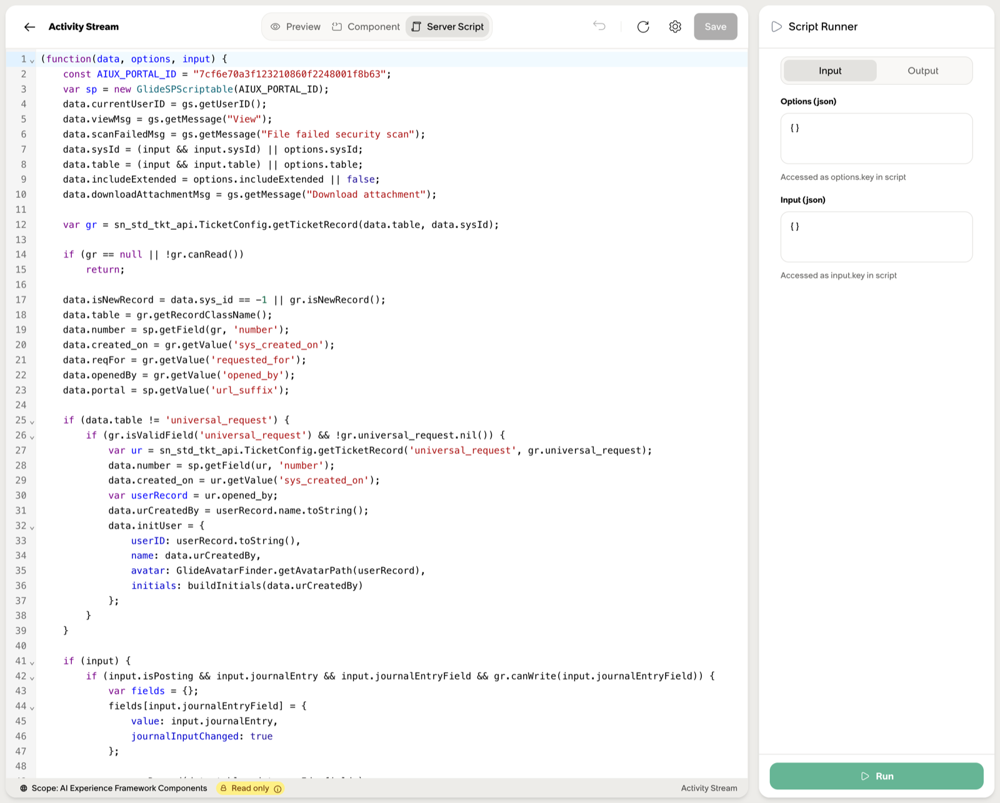

# Server Script

An sn_aiux widget's server script runs in the same Rhino engine as a Service Portal `sp_widget` server script, with the same IIFE signature:

```js
(function(data, options, input) {
  // ...
})(data, options, input);
```

Same JavaScript, same `gs.*` / `GlideRecord` / `GlideAggregate` / `GlideDateTime` surface you've used for a decade. If you've written Service Portal server scripts, you already know 95% of what runs here. This page only covers the 5% that's new or worth re-stating in an sn_aiux context. For the full reference of standard server APIs, see [Reference → Intellisense dump](../reference/intellisense.md).

---

## Server-script globals

Three globals are populated for you on every invocation:

| Global | Description |
|---|---|
| data | Output object. Populated server-side, becomes `this.data` on the client. |
| options | The widget instance's configured options. Shape mirrors the widget's `input_schema`. |
| input | Client-supplied payload, from `this.server.get({action, data})`. Empty on the initial render. |

Plus everything the platform exposes server-side:

| Global | Description |
|---|---|
| $aiux | The AIUX scriptable. New to this framework — see below. |
| gs | Standard `GlideSystem`. |
| GlideRecord, GlideRecordSecure, GlideQuery, GlideAggregate, GlideDateTime, GlideAjax, GlideSysAttachment, GlideStringUtil, … | Standard server APIs. Same behavior as anywhere else on the platform. |

---

## `$aiux` — the AIUX scriptable

The widget server-script context. A pure-JavaScript scriptable, not a Rhino-bridged Java object — `getClass()` will fail, `for...in` returns nothing. Don't try to introspect it; the surface is enumerated here.

Four documented methods:

| Method | Returns | Description |
|---|---|---|
| $aiux.getParameter(name) | string\|null | Walks precedence: **experience → page → path → search → request**. The "give me whatever's there" lookup. |
| $aiux.getPathParameter(name) | string\|null | URL path parameter only (e.g. `:sys_id` in `/record/:table/:sys_id`). |
| $aiux.getSearchParameter(name) | string\|null | URL query-string parameter only. |
| $aiux.getWidget(widgetId, options?) | {properties, tagName} | Fetch another widget's fully-populated server data. The composition primitive — Service Portal's `$sp.getWidget` analog. |

### Choosing between the three getters

`getParameter` is the omnibus call — it walks `experience → page → path → search → request` and returns the first hit. Use it when you don't care which surface the value came from.

`getPathParameter` and `getSearchParameter` are the precise versions for when you do care. Example: `sys_id` could appear in both `/record/incident/:sys_id` and `?sys_id=...`. If you need to distinguish, call the specific getter directly.

```js
data.sys_id  = $aiux.getParameter('sys_id');           // first wins
data.path_id = $aiux.getPathParameter('sys_id');       // path only
data.query_id = $aiux.getSearchParameter('sys_id');    // query only
```

### `$aiux.getWidget` — composition

`$aiux.getWidget` is the spiritual successor to Service Portal's `$sp.getWidget`. Calling it server-side returns the *fully-populated* `data` and `properties` of another `sys_aix_widget`. You pass `options` (the same shape the wrapped widget's `input_schema` declares), the framework executes that widget's server script, and you get its output back.

```js
const childData = $aiux.getWidget('people-card', {
  user_sys_id: gs.getUserID(),
});
// childData = { properties: {...}, tagName: 'people-card' }
```

That return value powers two patterns:

- Render `<${childData.tagName}>` in your Lit template (with `unsafeStatic`) to embed the other widget.
- Use `childData.properties` to compose a custom UI that includes the other widget's data without rendering its template.

For the broader AI composition story see [AI Integration](ai-integration.md).

---

## The `GlideSPScriptable` sidecar pattern

The one piece of `gs.*` worth flagging specifically. When an AIUX widget needs a portal-scoped `$sp` context — for parameter-passing helpers, cart/catalog state, anything that historically required `new GlideSPScriptable('portal_id')` — bind it to the AIUX sidecar `sp_portal` record:

```js
const AIUX_PORTAL_ID = "7cf6e70a3f123210860f2248001f8b63";  // sp_portal "aiuxsp"
var sp = new GlideSPScriptable(AIUX_PORTAL_ID);
```

The OOB Activity Stream widget does this verbatim. The sys_id is stable across instances — `aiuxsp` is the SP portal record that ships with the AIUX apps, and `GlideSPScriptable` bound to it gives you the same `$sp.*` surface you'd have inside a real Service Portal page.



This is the one place server-script code legitimately reaches into Service Portal infrastructure. See [Experiences → Overview](../experiences/overview.md) for the framework-level context.

---

## Server → client data flow

Your server script populates `data`. On the client, the Lit widget reads it via `this.data` (provided automatically by `AIUXWidgetElement`):

```js
// server script
(function(data, options, input) {
  data.user = { id: gs.getUserID(), name: gs.getUser().getDisplayName() };
})(data, options, input);
```

```js
// component
render() {
  return html`<p>Hello, ${this.data?.user?.name}</p>`;
}
```

To re-run the server script (for refresh after an action, or to fetch with new options): `this.server.refresh()`. To send an explicit payload: `this.server.get({ action: 'doThing', data: {...} })` — the server script receives the payload as `input`.

```js
// server script handling an action
(function(data, options, input) {
  if (input && input.action === 'doThing') {
    // mutate via GlideRecord, populate data with the result
  }
})(data, options, input);
```

For the full `this.server.*` API see [Component → Instance members](component.md).

---

## What's *not* on this page

The standard server-side APIs — `gs.*`, `GlideRecord`, `GlideQuery`, `GlideAggregate`, `GlideDateTime`, `GlideUser`, `GlideSession`, attachments, encryption, schedules, table hierarchy, and the rest — work exactly as they do anywhere else on the platform. They're not framework-specific and they're not re-documented here.

If you need a quick lookup, the [Intellisense reference](../reference/intellisense.md) has the full surface as a single searchable artifact, or the official ServiceNow docs are authoritative for behavior and edge cases.
