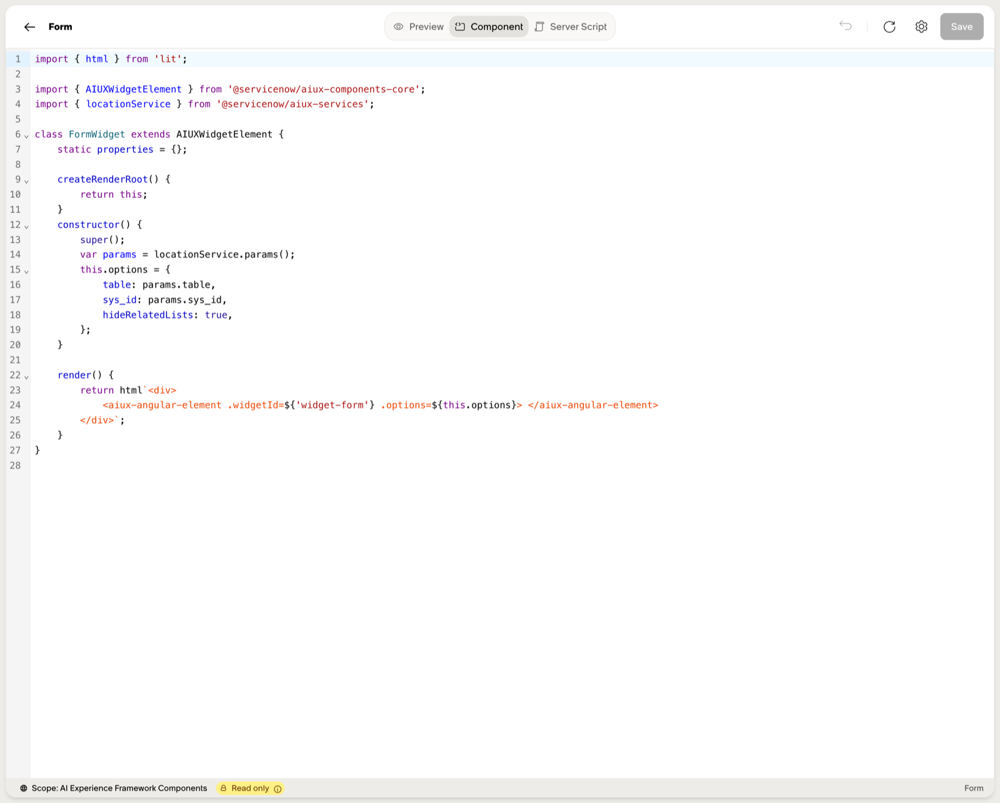

# Service Portal Bridge

The single most important architectural decision in `sn_aiux` is this: **it doesn't replace `sp_widget`. It embeds it.**

Three of the nineteen out-of-the-box widgets are pure adapters around existing Angular Service Portal widgets, surfacing them inside an `sn_aiux` experience with no modifications to the underlying widget. The mechanism is a Lit custom element called `<aiux-angular-element>`, and the pattern it enables is the migration story for anything you've already built.

## `<aiux-angular-element>`

A Lit element that, at mount time, bootstraps the embedded AngularJS Service Portal engine inside the Lit DOM, looks up an `sp_widget` by id, runs that widget's server script with the supplied `options`, and renders its Angular template inside the `sn_aiux` shell.

Usage from inside a `sys_aix_widget` Lit component:

```js
render() {
  return html`
    <aiux-angular-element
      .widgetId=${'widget-form'}
      .options=${this.options}>
    </aiux-angular-element>`;
}
```

Two property bindings, both with the `.` prefix (Lit JS bindings, not HTML attributes):

| Property | Type | Description |
|---|---|---|
| .widgetId | string | The `sp_widget.id` (kebab-case slug) of the widget to embed. |
| .options | Object | Options to pass to the wrapped widget. Same shape its `option_schema` declares. |

## How it works at runtime

When the Lit component mounts `<aiux-angular-element>`:

1. The framework spins up the embedded AngularJS Service Portal runtime inside the Lit DOM tree.
2. It looks up the `sp_widget` record by `id`.
3. It runs that widget's server `script` with `options` populated from `.options`.
4. It renders the widget's Angular template + client_script inside the shell.

The wrapped widget runs exactly as it does in Service Portal. `$sp` parameter passing works. `gs.*` and `GlideRecord` work. The widget's `data` object is populated by its own server script.

## The three OOB bridge widgets

| `sn_aiux` widget | Embeds `sp_widget` |
|---|---|
| Form (`form-widget`) | `widget-form` |
| Catalog Item (`catalog-item`) | `widget-sc-cat-item-v2` |
| Order Guide (`order-guide`) | `widget-sc-order-guide-v2` |

Here's the entire `component` for the Form widget — a complete, working bridge in twenty lines:

```js
import { html } from 'lit';
import { AIUXWidgetElement } from '@servicenow/aiux-components-core';
import { locationService } from '@servicenow/aiux-services';

class FormWidget extends AIUXWidgetElement {
  createRenderRoot() { return this; }
  constructor() {
    super();
    const params = locationService.params();
    this.options = {
      table: params.table,
      sys_id: params.sys_id,
      hideRelatedLists: true,
    };
  }
  render() {
    return html`
      <aiux-angular-element
        .widgetId=${'widget-form'}
        .options=${this.options}>
      </aiux-angular-element>`;
  }
}
```

The Form widget's own server script is empty — there's nothing for it to do. All the work happens inside `widget-form`.




## When to use the bridge

Use the bridge when:

- A complex Angular widget already exists and works. Catalog items, order guides, record forms, anything with cart logic, variable trees, or form-engine bindings.
- You want to ship an `sn_aiux` experience quickly without rewriting your widget library.
- You're migrating an existing Service Portal portal to `sn_aiux` and want the cutover to be invisible to end users.

Use native Lit when:

- You're building a new widget from scratch.
- The widget needs `client_tools` for AI agent integration (the bridge layer can't expose those on the embedded widget).
- The widget is presentational and doesn't need the Service Portal scriptable runtime.

The two coexist inside the same page. A typical real-world experience mixes native Lit widgets with bridged Service Portal widgets without anyone noticing the seam.

## The theming sidecar

When you bridge a Service Portal widget into `sn_aiux`, the embedded Angular renderer needs a theme to style the widget with. That's where the `sp_portal` record with url_suffix `aiuxsp` comes in — it's a sidecar that carries the theme used to reskin embedded SP widgets so they render against Tailwind/DaisyUI tokens instead of looking like 2016-era Bootstrap dropped into a modern page.

`sn_aiux` itself does not run on Service Portal. The `aiuxsp` portal record only matters when SP widgets get bridged in. Pure-Lit `sn_aiux` widgets never touch it. See [Experiences → Overview](../experiences/overview.md) for the framework-level context.

## Worked example

For a step-by-step walkthrough that takes the OOB Cool Clock Service Portal widget and surfaces it inside an `sn_aiux` page, see [Getting Started → Your first widget](../getting-started/your-first-widget.md).
